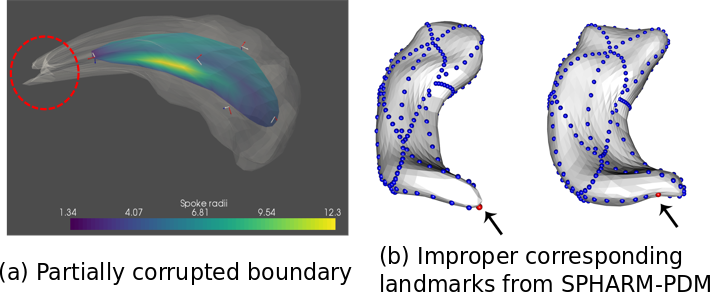
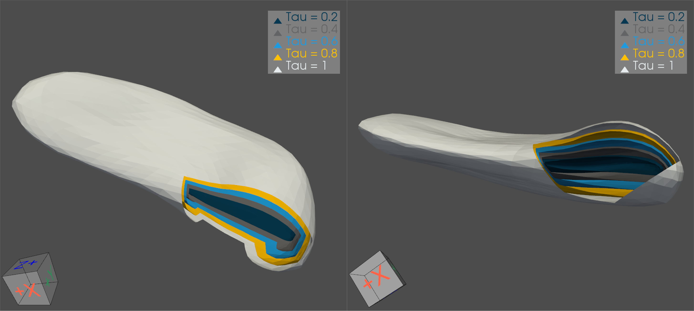
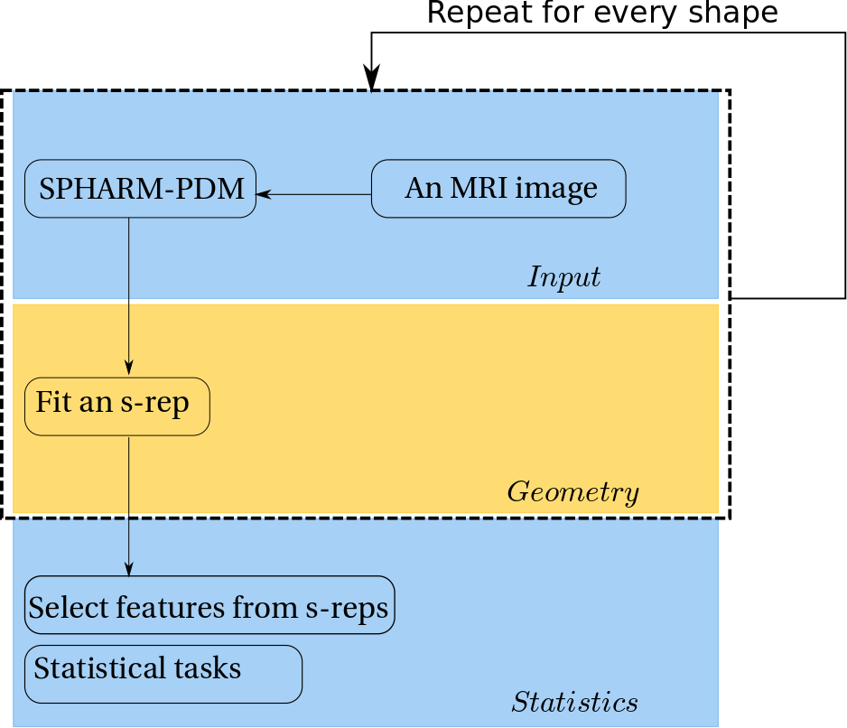
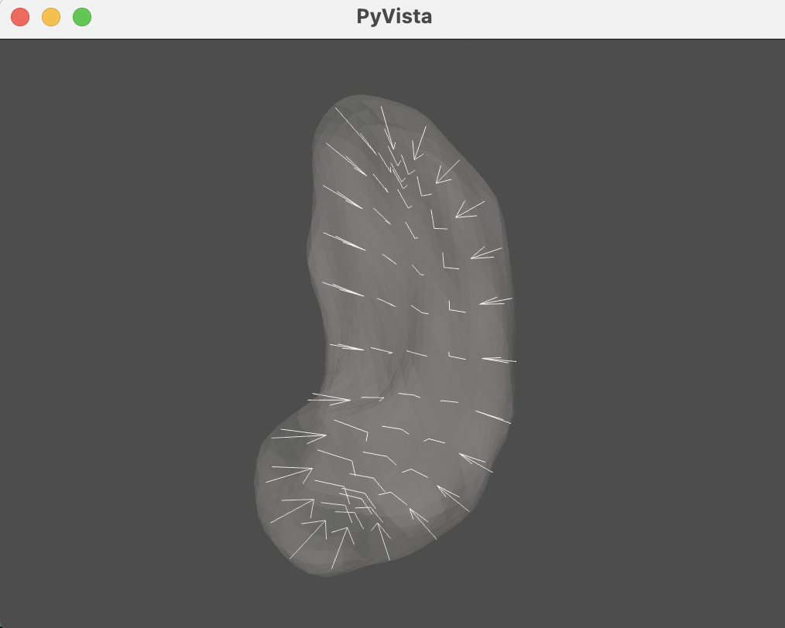
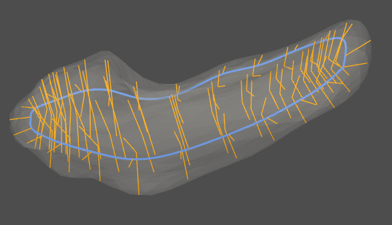
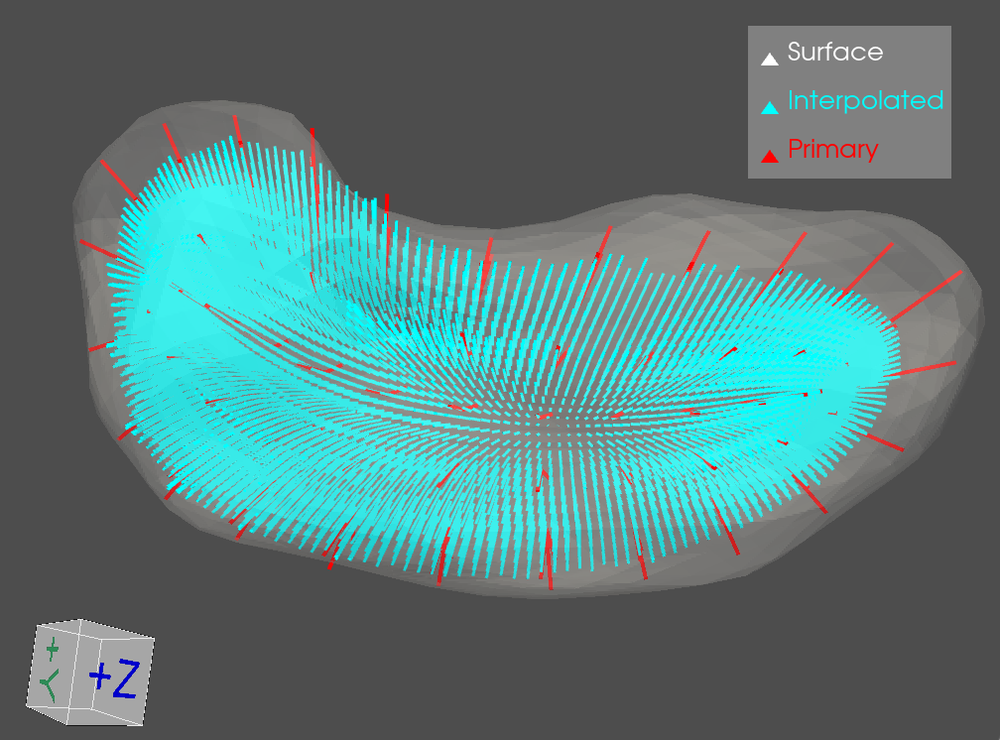

SHANAPY: SHape ANAlysis PYthon package using s-reps
===
This repository is the codebase of the following articles:
> Liu, Z., Hong, J., Vicory, J., Damon, J.N. and Pizer, S.M., 2021. Fitting unbranching skeletal structures to objects. Medical image analysis, 70, p.102020.

> Liu, Z., Schulz, J., Taheri, M., Styner, M., Damon, J., Pizer, S. and Marron, J.S., 2022. Analysis of joint shape variation from multi-object complexes. Journal of Mathematical Imaging and Vision, pp.1-21.

> Liu, Z., Damon, J., Marron, J.S., and Pizer, S., 2023. Geometric and Statistical Models for Analysis of Two-Object Complexes. International Journal of Computer Vision. https://doi.org/10.1007/s11263-023-01800-2

## Table of Contents

1. [Introduction: what is an s-rep & why is it useful?](#intro)
2. [Installation](#use)
3. [Examples](#example)
- [Initialize an s-rep](#initialize)
- [Refine an s-rep](#refinement)
- [Interpolate an s-rep for denser spokes](#interpolate)
- [Fit Principal Nested Spheres (PNS) to non-Euclidean data](#pns)

<a name="intro"></a>

## Introduction

### What are s-reps?

An s-rep is a skeletal representation of an object. In the continuous regime, an s-rep consists of a skeleton and a radial vector field defined (based) on the skeleton.
Though a continuous s-rep is desirable in some situations (e.g., refinement), a discrete s-rep is favorable in statistical analysis because of good correspondences across a population.
A discrete s-rep (also referred to an s-rep in some places) consists of skeletal points, and spokes that connect the skeletal points and boundary points.
The skeletal points form quadrilaterals on the skeleton. A continuous skeleton is thus approximated by the combination of these quadrilaterals.

This package provides an algorithm to obtain a discrete s-rep that best fit to a 3D object.
Often, the object of interest has a close and smooth boundary with no holes.
The discretized skeletal sheet sits in the near-medial place of the object. These skeletal points are sampled in a consistent way to provide good correspondences.
At these skeletal points, spokes are correspondingly sampled from the radial vector field. These spokes define the mapping from the skeletal geometry to the boundary geometry.
A reader can refer to chapter 3 in the book
> K. Siddiqi and S. Pizer, Medial representations: mathematics, algorithms and applications, 2008
for more details about the relation between the skeletal and boundary geometry.

A formal definition of an s-rep and the discretization of an s-rep can be found in the paper
> Z. Liu et al., Fitting unbranching skeletal structures to objects, Medical Image Analysis, 2021

### Anatomical shape analysis with s-reps

Anatomical shapes are typically obtained from segmentation of medical images. It is often problematic to use boundary geometry in analyzing a population of anatomical shapes for the following reasons.
First, the boundary is often noisy, sometimes correupted (see the figure (a) below). These noise and corruptions unexpectedly draw too much attention in statistical analysis.
Therefore, the results from analyzing boundaries can be biased and difficult to generalize to new shapes.
Second, it is difficult to establish good correspondences on 3D objects. There exist methods (e.g., SPHARM-PDM) producing mathematical landmarks of an object.
However, the correspondences of these landmarks across a population can be not anatomically reasonable (see the figure (b) below).


In contrast, s-reps take the interior geometry of an object into consideration, making the geometric features more robust.
The skeleton shape and the differential properties of spokes allow us to reconstruct the boundary geometry from the skeletal geometry.
This reconstructed boundary is also referred to as the `implied boundary` or `onion skin` (see the figure below).


S-reps provide rich anatomical shape features. A user can select appropriate features according to the data and tasks.
The features provided by s-reps include:

(1) Geometric features of implied boundaries. S-reps can produce corruption-free smooth boundary mesh. Moreover, the implied boundary points have good correspondences across a population.

(2) Radial geometry from spokes. A spoke is represented by a tuple containing (a) coordinates of the base (skeletal) point (b) a unit direction vector in $\mathbb{R}^3$ and
(c) a positive scalar value that indicates the spoke's length.

The workflow of using s-reps can be summarized in the following chart.


Please cite and refer to the following papers for more details.

> Z. Liu et al., Non-Euclidean Analysis of Joint Variations in Multi-Object Shapes, 2021

> S. Pizer et al. Skeletons, Object Shape, Statistics, Frontiers in Computer Science, section Computer Vision, 2022

---
<a name="use"></a>
## Installation
1. (Optional) Download [SPHARM-PDM](https://www.nitrc.org/projects/spharm-pdm) according to your platform into `third_party/spharm_bin`.
2. Install shanapy module as follows
```bash=
## clone the source code
$ cd ~
$ git clone https://github.com/ZhiyLiu/shanapy.git
$ cd shanapy

## create & activate a virtual envirionment
## assume the anaconda has been installed
$ conda create -n shanapy python=3.7 anaconda
$ source activate shanapy

## install required packages (optional)
## $ python -m pip install -r requirements.txt

## install pyshanalysis
$ python -m pip install -e .
```

---

<a name="example"></a>
## Example
<a name="initialize"></a>
### 1. Initialize and visualize a discrete s-rep for a hippocampus

The example data (a hippocampus) is provided [here](data/example_hippocampus.vtk). The example code is in [this file](shanapy/test/test_initializer.py). To run the example,
```bash=
## The required additional packages can be installed via pip.
## make sure the current directory is ~/shanapy/
$ pwd
$ python shanapy/test/test_initializer.py
```
The above commands result in a fitted s-rep the example hippocampus. Also, a visualization window should show as follows.


The transparent surface is the boundary of the hippocampus. The white line segments are discrete spokes connecting the skeleton and the boundary.

---
<a name="refinement"></a>
### 2. Refine the above s-rep

The example code for the refinement is in [this file](shanapy/test/test_refiner.py). To run the example,
```bash=
## The required additional packages can be installed via pip.
## make sure the current directory is ~/shanapy/
$ pwd
$ python shanapy/test/test_refiner.py
```
The refinement yields a better fit s-rep, as shown below.


The orange line segments are from the above initial s-rep. The blue curve is the fold curve.
The black arrow points to a spoke that was initially longer than expected but was refined due to the refinement algorithm.

---
### <a name="interpolate"></a> 3. Interpolate an s-rep for denser spokes

The interpolation can convert a discrete s-rep to a continuous one, based on which the implied level surfaces of radial distances can be generated. This algorithm takes in a discrete s-rep from the initialization or the refinement stage. The algorithm interpolates
- skeletal points
- spokes' directions
- spokes' lengths.

The example code can be found in [this file](shanapy/test/test_interpolater.py). Run the code similar to the above example. The following figure shows the interpolated spokes on one side of a hippocampal s-rep.


---
### <a name="pns"></a> 4. Fit PNS model

[PNS](https://github.com/sungkyujung/PNS) captures principal components of data distributed on a unit hypersphere. The PNS scores are taken as Euclidean representations of non-Euclidean data, which has shown notable statistical advantages (see `Pizer et al. Object Shape Representation via Skeletal Models (s-reps) and Statistical Analysis, 2019`).

The example code in [test_pns.py](shanapy/test/test_pns.py) demonstrates Euclideanizing spherical [data](https://github.com/ZhiyLiu/shanapy/raw/main/data/toy_example_small_circle.mat) (on $\mathbb{S}^2$) via PNS and then comparing PNS components with PCA components. The [comparison](https://github.com/ZhiyLiu/shanapy/blob/main/figures/cmp_pns_pca.png) shows that PNS components are more statistically efficient. To reproduce the comparison,

```bash=
## The required additional packages can be installed via pip.
## make sure the current directory is ~/shanapy/
$ pwd
$ python shanapy/test/test_pns.py
```
---
## Acknowledgement

This project is adviced by Stephen M. Pizer, J. S. Marron and James N. Damon.
J. Hong initiates this project. J. Vicory and B. Paniagua significantly contributed to this project.
Thanks to M. Styner for providing insightful comments and experimental data.
Special thanks to my great colleagues A. Krishna, M. Taheri, N. Tapp-Hughes, A. Sharma and J. Schulz for their feedback and contributions.

###### tags: `Simulation` `Shape models` `Shape analysis`
